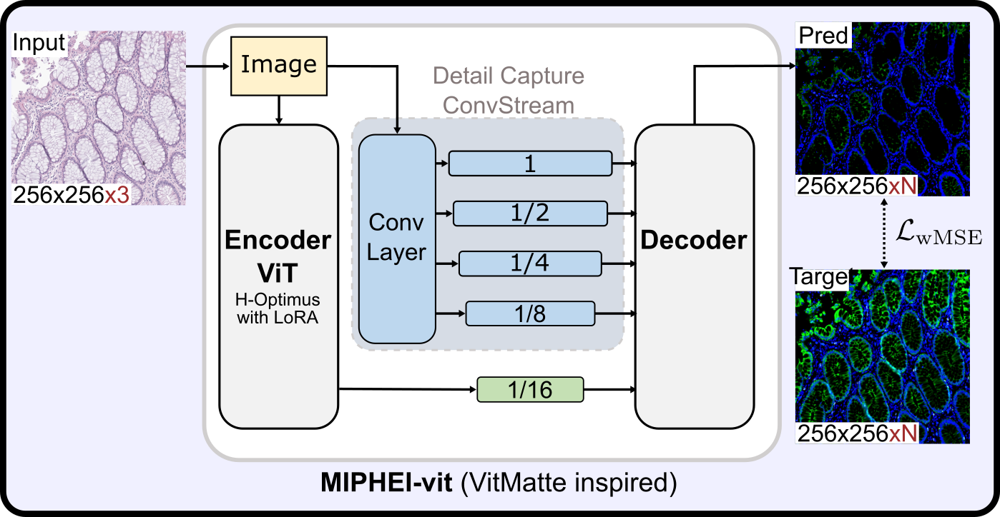
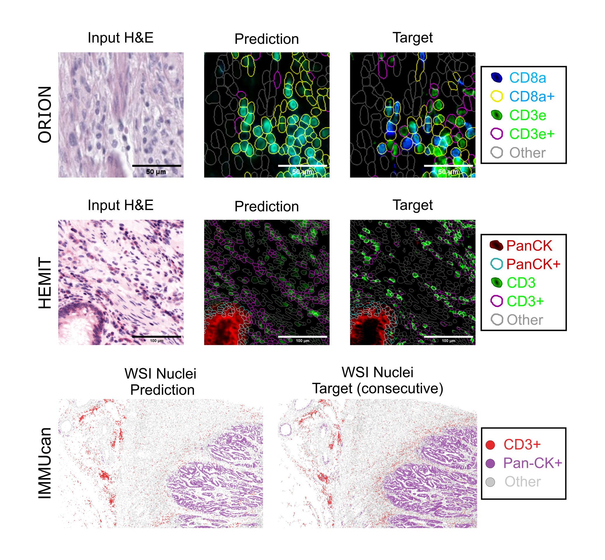

# **MIPHEI-vit: Multiplex Immunofluorescence Prediction from H&E Images using ViT Foundation Models**


This repository supports full **reproducibility** of our paper on predicting **multiplex immunofluorescence (mIF)** from standard **H&E-stained histology images**.  
It includes all **code**, **pretrained models**, and **preprocessing steps** to replicate our results or apply the approach to new datasets.

We introduce **MIPHEI-vit**, a **U-Net-style model** using **H-Optimus-0**, a ViT foundation model, as its encoder to predict **multi-channel mIF images** from H&E slides.  
Inspired by **ViTMatte**, the architecture combines **transformer-based encoding** with a **convolutional decoder**.

Paired with **CellPose** for nuclei segmentation, MIPHEI-vit enables **single-cell level cell type prediction** directly from H&E.

We cover key markers from the **ORION dataset**, including:  
**Hoechst**, **CD31**, **CD45**, **CD68**, **CD4**, **FOXP3**, **CD8a**, **CD45RO**, **CD20**, **PD-L1**, **CD3e**, **CD163**, **E-cadherin**, **Ki67**, **Pan-CK**, **SMA**.  
📊 Performance for each marker is detailed in the paper.

---

## 📦 Installation

To get started, you can install the environment with:

```bash
conda env create -f environment.yaml --name miphei
conda activate miphei
pip install -r requirements_torch.txt
pip install -r requirements.txt
pip install -e slidevips-python
pip install -r requirements_preprocessings.txt  # only if you want to run the preprocessing pipeline
```

We recommend using **Conda**, as it simplifies the installation of certain dependencies like `pyvips`, which are not always easy to install via `pip`.

---

## 📁 Data Download

We provide processed and cleaned data derived from the **Orion CRC** and **HEMIT** datasets. **IMMUCAN** data is not yet released due to ongoing privacy restrictions.

You can download the full dataset from Zenodo:

🔗 https://doi.org/10.5281/zenodo.15340874

- **Orion**: Fully included in the Zenodo archive.
- **HEMIT**: Supplementary data only (e.g., cell segmentations, inferred cell types).
    - You must download the **original HEMIT dataset** separately from [here](https://data.mendeley.com/datasets/3gx53zm49d/1).
    - Then, run `preprocessings/hemit_preprocessing.ipynb` to **merge it with our annotations** and generate required dataframes. You can also regenerate the additional data from this notebook

After downloading the data, update paths in the following config files:

- `configs/orion.yaml, configs/hemit.yaml`
    - Make sure to set: `slide_dataframe_path, train_dataframe_path, val_dataframe_path, test_dataframe_path, augmentation_dir` (optional; CycleGAN-augmented tiles)*,* `channel_stats_path`, `targ_channel_names`

Also update the paths inside the dataframes, if needed.

---

## 🧠 Model Checkpoints

<p align="center">
  <strong>Figure: MIPHEI-vit Architecture</strong><br>
  
</p>

The pretrained model weights can be downloaded from  <a href="https://huggingface.co/Estabousi/MIPHEI-vit" target="_blank">
  
  Hugging Face
</a>.

You can download original HEMIT checkpoint [here](https://github.com/BianChang/Pix2pix_DualBranch).

Each model is organized in a folder containing:

- the model checkpoint (`.ckpt` or `.safetensors`)
- a `config.yaml` file with training and architecture parameters
- `.csv` files with evaluation results for the 3 datasets

---

## 🔍 Inference

You can use the pretrained models to run inference on **ORION**, **HEMIT**, or your **own custom H&E images**. 

### On ORION/HEMIT data:

To visualize predictions on ORION or HEMIT datasets, use the following notebook:

- `notebooks/inference_orion_hemit.ipynb`

You can also run this python script:

```bash
python run_inference.py \
  --checkpoint_dir path/to/model_folder \
  --dataset_config_path path/to/config.yaml \
  --batch_size 16
```

This will generate a new folder inside`checkpoint_dir` containing **predicted TIFF images** for the entire dataset.

⚠️ *Note: This can produce large amounts of data depending on dataset size.*

### On your own dataset

If you want to try the model on your own H&E images:

- Use the notebook: `notebooks/inference.ipynb`
- Or [](https://colab.research.google.com/github/Sanofi-Public/MIPHEI-ViT/blob/main/notebooks/colab_inference.ipynb)

---

## Evaluation

You can reproduce the evaluation results reported in the paper on the **ORION** and **HEMIT** datasets using the following scripts inside `evaluations` folder:

- **ORION**:
    
    ```bash
    python eval_orion.py --checkpoint_dir path/to/model
    ```
    
- **HEMIT**:
    
    ```bash
    python eval_hemit.py --checkpoint_dir path/to/model
    ```
    
- **IMMUCAN** *(not publicly available)*:
    
    The script `evaluations/eval_immucan.py` was used to evaluate on the IMMUCAN dataset, but the data is not included due to access restrictions.
    

We also provide evaluation scripts — `evaluations/eval_orion_hemit.py` and `evaluations/eval_hemit_hemit.py` — to evaluate models trained using the original **HEMIT codebase**, including:

- the **official HEMIT checkpoint**
- **HEMIT-ORION**: a model trained on the ORION dataset using the HEMIT codebase

The `hemit/` folder contains the modified training and preprocessing scripts used to train **HEMIT-ORION** on the original HEMIT codebase.

All figures from the paper can be reproduced using the notebooks in the `figure/` directory.

<p align="center">
  <strong>Figure: Example of mIF prediction from H&E on 3 datasets</strong><br>
  
</p>

---

## 🚀 Training

To train **MIPHEI-vit** from scratch on the **ORION** dataset, run:

```bash
python run.py +default_configs=miphei-vit
```

If you **don’t want to use Weights & Biases**, run:

```bash
WANDB_MODE=offline python run.py +default_configs=miphei-vit
```

You can find the list of available default configurations in `configs/default_configs/`.
To apply MIPHEI-vit model to your own dataset, create a config file like `own_data.yaml` in `configs/data/` and run

```bash
python run.py +default_configs=miphei-vit data=own_data
```

You can override any parameter directly via the command line. For example, to set the number of training epochs to 100:

```bash
python run.py +default_configs=miphei-vit ++train.epochs=100
```

All experiments from the paper are located in `configs/experiments/`. You can run one of them like this:

```bash
python run.py -m +experiments/foundation_models='glob(*)'
```

---

### 🧰 SlideVips

Alongside this code, we developed a high-performance `pyvips`-based tile reader and processing engine for **efficient WSI operations**, supporting both H&E and high-dimensional mIF images. This provides an alternative to tools like OpenSlide, with full support for multi-channel fluorescence.

You can refer to slidevips-python/README.md

---

## 📑 Preprocessing Pipeline

To reproduce the preprocessing steps for the **ORION** dataset or to apply them to your own data, please refer to: `preprocessings/README.md`. It contains detailed instructions on running the full pipeline, including tile extraction, autofluorescence subtraction, artifact removal, cell segmentation, etc.

---

## 📖 Citation

If you use this work, please cite:

> G. Balezo, R. Trullo, A. Pla Planas, E. Decenciere, and T. Walter, “MIPHEI-vit: Multiplex Immunofluorescence Prediction from H&E Images using ViT Foundation Models,” arXiv preprint arXiv:…, 2025.
>
