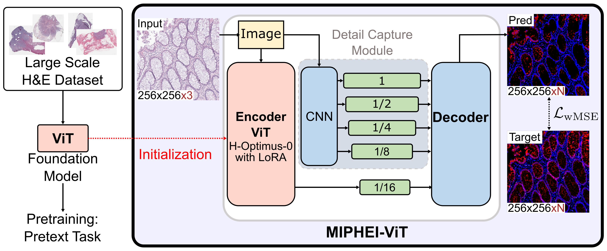
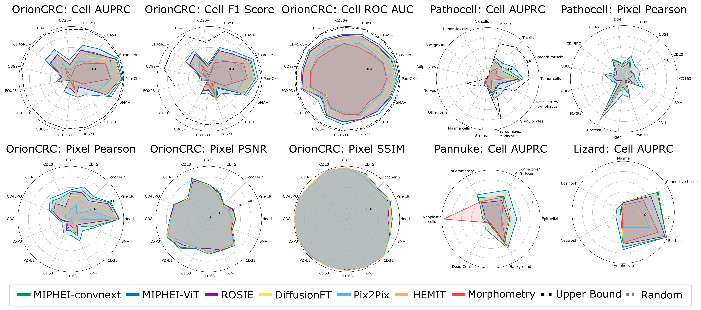

# **MIPHEI-vit: Multiplex Immunofluorescence Prediction from H&E Images using ViT Foundation Models**

<p align="center">
  
</p>

<p align="center">
  <a href="https://www.sciencedirect.com/science/article/pii/S0010482526001277" target="_blank" rel="noopener noreferrer" style="display: inline-block; vertical-align: middle;">
    
  </a>
  <a href="https://arxiv.org/abs/2505.10294" target="_blank" rel="noopener noreferrer" style="display: inline-block; vertical-align: middle;">
    
  </a>
  <a href="https://zenodo.org/records/15340874" target="_blank" rel="noopener noreferrer" style="display: inline-block; vertical-align: middle;">
    
  </a>
</p>

This repository supports full **reproducibility** of our paper on predicting **multiplex immunofluorescence (mIF)** from standard **H&E-stained histology images**.  
It includes all **code**, **pretrained models**, and **preprocessing steps** to replicate our results or apply the approach to new datasets.

We introduce **MIPHEI-vit**, a **U-Net-style model** using **H-Optimus-0**, a ViT foundation model, as its encoder to predict **multi-channel mIF images** from H&E slides.  
Inspired by **ViTMatte**, the architecture combines **transformer-based encoding** with a **convolutional decoder**.

Paired with **CellPose** for nuclei segmentation, MIPHEI-vit enables **single-cell level cell type prediction** directly from H&E.

We cover key markers from the **ORION dataset**, including:  
**Hoechst**, **CD31**, **CD45**, **CD68**, **CD4**, **FOXP3**, **CD8a**, **CD45RO**, **CD20**, **PD-L1**, **CD3e**, **CD163**, **E-cadherin**, **Ki67**, **Pan-CK**, **SMA**.  
📊 Performance for each marker is detailed in the paper.

Run MIPHEI-ViT on H&E tiles & reproduce the results: [](https://colab.research.google.com/github/Sanofi-Public/MIPHEI-ViT/blob/main/notebooks/colab_inference.ipynb)

---

## 🛠️ Project Status
Last updated: December 2025

- ✅ Benchmark Update on OrionCRC, HEMIT, PathoCell, Lizard, PanNuke (December)
- ✅ Data Download Scripts (December)
- ✅ ROSIE and DiffusionFT comparision (December)
- ✅ Code cleanup (PEP8 compliance)
- ✅ Bootstrap analysis integrated in evaluation folder
- ✅ Correction of H&E normalization for MIPHEI checkpoint
- ✅ SlideVips updated and optimized (RAM issue fixed)
- ✅ WSI inference pipeline implemented
- ✅ Google Colab Notebook Update
- ✅ Fix normalization issue
- ✅ Add pixel level metrics in evaluation scripts

**Planned / To Do:**
- [ ] Refactor preprocessing pipeline for PEP8 compliance  
 
---

## 📦 Installation

To get started, you can install the environment with:

```bash
conda env create -f environment.yaml --name miphei
conda activate miphei
pip install -r requirements_torch.txt
pip install -r requirements.txt
pip install -e slidevips-python
pip install -r requirements_preprocessings.txt  # only if you want to run the preprocessing pipeline
```

We recommend using **Conda**, as it simplifies the installation of certain dependencies like `pyvips`, which are not always easy to install via `pip`.

---

## 📁 Data Download

We provide several processed datasets used in our H&E → mIF prediction experiments and cell-level evaluations.

All **preprocessed versions of OrionCRC and HEMIT** are publicly available on Zenodo:

🔗 Zenodo archive: https://doi.org/10.5281/zenodo.15340874

### Included in the Zenodo package:
- **OrionCRC**: Fully preprocessed (H&E and mIF tiles, cell segmentations and cell types).
- **HEMIT**: Preprocessed supplementary data (cell segmentations and cell types).

### Additional supported datasets
Our framework also supports several external datasets used for mIF benchmarking at pixel and cell-level:

- **H&E + mIF datasets**
    - **OrionCRC**
    - **HEMIT**
    - **PathoCell**
- **H&E panoptic/cell segmentation datasets** (evaluation only)
    - **Lizard**
    - **PanNuke**

Instructions for automatically downloading all datasets, as well as adding your own custom dataset, are available in `datasets/README.md`.

---

## 💾 Model Checkpoints

<p align="center">
  <strong>Figure: MIPHEI-vit Architecture</strong><br>
  
</p>

<ul>
  <li>
    The MIPHEI-ViT model weights can be downloaded from the release.
  </li>

  <li>
    <p>
      The other models used for comparison in the paper—<strong>MIPHEI-HEMIT</strong>, <strong>HEMIT-ORION</strong>, <strong>UNETR H-Optimus-0</strong>, and <strong>U-NET ConvNeXtv2</strong>—are accessible on
      <a href="https://wandb.ai/guillaume-balezo/MIPHEI-ViT_paper/artifacts/" target="_blank">
        
        Weights & Biases
      </a>.
    </p>
  </li>

  <li>
    You can download original HEMIT checkpoint <a href="https://github.com/BianChang/Pix2pix_DualBranch">here</a>.
  </li>
</ul>

To automatically download all model checkpoints into the `checkpoints/` folder, run:

```bash
python scripts/download_checkpoints.py
```

Each model is organized in a folder containing:

- the model checkpoint (`.ckpt` or `.safetensors`)
- a `config.yaml` file with training and architecture parameters
- `.parquet` and `.csv` files with evaluation results for the 3 datasets

---

## 🔍 Inference

You can use the pretrained models to run inference on **ORION**, **HEMIT**, or your **own custom H&E images**.

### On Whole Slide Images (WSI)
To run inference directly on a full-resolution WSI (e.g., .svs, .tiff, .ndpi), use:

```bash
python run_wsi_inference.py \
  --slide_path path/to/slide.wsi \
  --checkpoint_dir path/to/miphei_checkpoint \
  --output_dir path/to/save_predictions
```

Additional parameters are available to control tile size, overlap, batch size, and inference magnification.

See run_wsi_inference.py --help for the full list of options.

### On Tiles from ORION/HEMIT data:

To visualize predictions on ORION or HEMIT datasets, use the following notebook:

- `notebooks/inference_orion_hemit.ipynb`

You can also run this python script:

```bash
python run_inference.py \
  --checkpoint_dir path/to/model_folder \
  --dataset_config_path path/to/config.yaml \
  --batch_size 16
```

This will generate a new folder inside`checkpoint_dir` containing **predicted TIFF images** for the entire dataset.

⚠️ *Note: This can produce large amounts of data depending on dataset size.*

### On your own dataset

If you want to try the model on your own H&E images:

- Use the notebook: `notebooks/inference.ipynb`

---

## Benchmark

You can run evaluation (pixel-level, cell-level, efficiency, visualizations) in the `benchmark/` folder on the **OrionCRC**, **HEMIT**, **PathoCell**, **Lizard**, **PanNuke** datasets. See `benchmark/README.md` for usage and examples.

- **ORION**:
    
    ```bash
    python run_benchmark.py --checkpoint_dir path/to/model --dataset orion -- model model_type
    ```
    
- **HEMIT**:
    
    ```bash
     python run_benchmark.py --checkpoint_dir path/to/model --dataset hemit -- model model_type
    ```
    
**IMMUCAN** *is not yet publicly available*


All figures from the paper can be reproduced using the notebooks in the figure/ directory.

<p align="center">
  <strong>Figure: Example of mIF prediction from H&E on 3 datasets</strong><br>
  
</p>

---

## 🚀 Training

To train **MIPHEI-vit** from scratch on the **ORION** dataset, run:

```bash
python run.py +default_configs=miphei-vit
```

If you **don’t want to use Weights & Biases**, run:

```bash
WANDB_MODE=offline python run.py +default_configs=miphei-vit
```

You can find the list of available default configurations in `configs/default_configs/`.
To apply MIPHEI-vit model to your own dataset, create a config file like `own_data.yaml` in `configs/data/` and run

```bash
python run.py +default_configs=miphei-vit data=own_data
```

You can override any parameter directly via the command line. For example, to set the number of training epochs to 100:

```bash
python run.py +default_configs=miphei-vit ++train.epochs=100
```

All experiments from the paper are located in `configs/experiments/`. You can run one of them like this:

```bash
python run.py -m +experiments/foundation_models='glob(*)'
```

---

## 🧰 SlideVips

Alongside this code, we developed a high-performance `pyvips`-based tile reader and processing engine for **efficient WSI operations**, supporting both H&E and high-dimensional mIF images. This provides an alternative to tools like OpenSlide, with full support for multi-channel fluorescence.

You can refer to slidevips-python/README.md

---

## 📑 Preprocessing Pipeline

To reproduce the preprocessing steps for the **ORION** dataset or to apply them to your own data, please refer to: `preprocessings/README.md`. It contains detailed instructions on running the full pipeline, including tile extraction, autofluorescence subtraction, artifact removal, cell segmentation, etc.

---

## 📖 Citation

If you use this work, please cite:

```bibtex
@article{balezo2026miphei,
  title={MIPHEI-ViT: Multiplex immunofluorescence prediction from H\&E images using ViT foundation models},
  author={Balezo, Guillaume and Trullo, Roger and Pla Planas, Albert and Decenciere, Etienne and Walter, Thomas},
  journal={Computers in Biology and Medicine},
  volume={206},
  pages={111564},
  year={2026},
  doi={10.1016/j.compbiomed.2026.111564}
}
```
